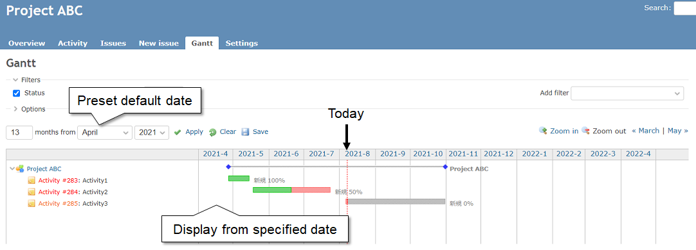
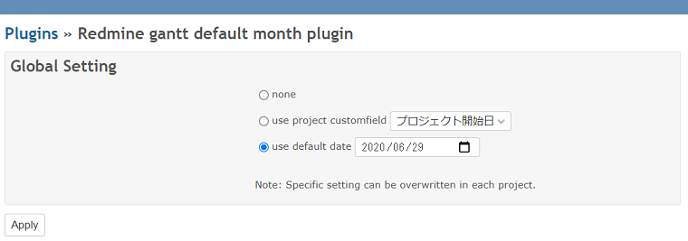
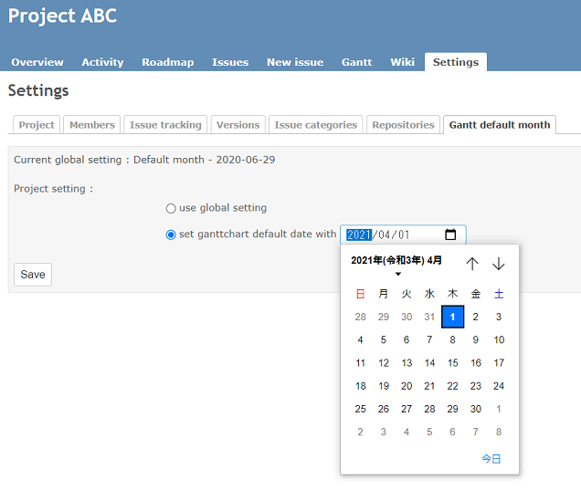

# redmine_gantt_default_month
System administrator and project manager can preset ganttchart default month.

# Screenshots
#### Overview

# Installation notes

## Install

<pre>
git clone https://github.com/aki360P/redmine_gantt_default_month.git
bundle install
rake redmine:plugins:migrate NAME=redmine_gantt_default_month RAILS_ENV=production
</pre>
and then restart server

## UnInstall

<pre>
rake redmine:plugins:migrate NAME=redmine_gantt_default_month VERSION=0 RAILS_ENV=production
</pre>

# Plugin setting
## Global setting (system administrator)
Please choose option to enable plugin with administrator plugin configration.

## Project setting (project manager)
Project manager can overwrite specific setting as a project default.

